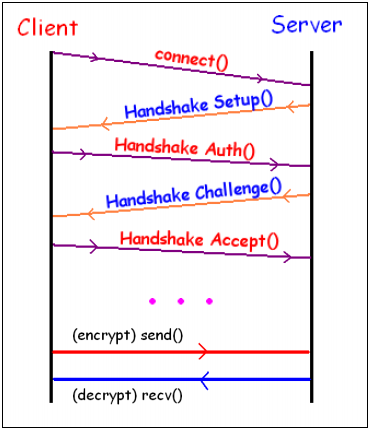
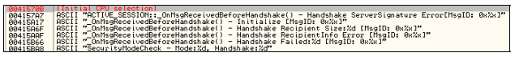
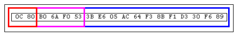

# A Guide to Silkroad's Security

### Introduction

This article will explain the current security system implemented in the MMORPG Silkroad Online. This guide will serve as a reference to the security protocol used by the game so you, the reader, can get a good understanding of what the game does to protect itself from outsiders. Once you understand how it all works, you will be able to implement it into your own programs.

As with any advance topics such as this, it will be assumed you have some knowledge of basic reverse engineering techniques, C/C++ experience, as well as an understanding of security concepts in general. I will provide plenty of pictures, side notes, and code to make this article as effective as possible, but it will be ultimately up to you to do the extra research when needed. With that said, it is time to get started!

### General Overview

To get started with a general overview on the Silkroad security protocol, here is a little picture to show what goes on in the security process.

<figure><figcaption></figcaption></figure>

The process starts when a Client wishes to connect to the server. Upon receiving the connection request, the Server sends a handshake setup packet to the client. This packet is parsed by the client and the security protocol is initialized. After the security system is initialized, the client sends a handshake authentication message to the server to establish its identity. Given this information, the server generates a handshake challenge message for the client to verify its identity. If the message matches what the client expects, then the client will send a handshake acceptance message to the server and the process is competed. If anything does not match up during the process, the connection will be closed.

After the handshake process has been completed, the client has a blowfish key that is used to encrypt and decrypt packets. Not all packets sent and received are encrypted or decrypted. This comes to a bit of a surprise in some cases, but makes a few things easier for us in the long run. Packets that are encrypted have an easy to identify marking, so when receiving or sending a packet, it will be obvious if it is encrypted or not.

The general format for Silkroad packets is as follows:

```c
// This is the generic packet structure
struct tPacket
{
    // Size of this packet
    WORD size;
    // Opcode of this packet
    WORD opcode;
    // Security count byte (0 from server to client packets)
    BYTE securityCount;
    // Security crc byte (0 from server to client packets)
    BYTE securityCRC;
    // Pointer to the remaining data and other packets
    BYTE dataPointer[8186];
};
```

**Size** – 2 bytes. The size of the data payload of the packet. Once again, this does not include the 6 bytes for the header.\
**Opcode** – 2 bytes. The opcode for the packet.\
**SecurityCount** – 1 byte. 0 if the packet is being sent from the server. This is only set for client to server packets.\
**SecurityCRC** – 1 byte. 0 if the packet is being sent from the server. This is only set for client to server packets.\
**DataPointer** – 0 or more bytes. This is the remaining data of the packet or possible more packets. I list it as being a max of 8186 bytes since that is the physical limit for the data being received along with the packet header, a total of 8192 bytes in a call to recv().

Now, for a few important notes on Silkroad packets that you should know:

* The packet header is 6 bytes total.
* On encrypted packets, the first two bytes, which refer to the size, are never encrypted.
* However, an encrypted packet is marked with a bit mask of 0x8000.
* The security count and CRC bytes are only set by the client and the server verifies them. If it fails, you will be disconnected.
* Packets are not received individually, they are grouped together. This means you will have to parse through the entire data stream received from the server.
* Packets are not guaranteed to be received in whole. This means you will have to maintain a buffer and check before you can parse a packet.

These notes will be expanded upon in the rest of the article, but deserve mention of now for a good base working knowledge.

Now that the general overview is completed, it is time to get to the specifics. What follows are three sections on each part of the protocol as well as applications of implementing the concepts and sample implementations. Rather than have to mess around with the Silkroad client, I will use the Silkroad launcher as the base means of study. This makes reversing a lot more simple since the code is very small and very fast to launch. For this article I will be using OllyDbg as the dissembler.

### The Handshake Process

The first question to be addressed is that of how do we know Silkroad even uses a handshake process? Part of the process of improving your skills as a reverse engineer is to look for the obvious. This does not fail us here. If we search through the referenced text strings for _Silkroad.exe_, we will come across the following:

<figure><figcaption></figcaption></figure>

Doing preliminary research by searching through the text strings immediately gives away some crucial information on what to expect. To be sure though, we should take a look at the packets sent back and forth between the client and server.

Here is an example listing of the first four messages (which happen to be the handshake process packets) captured using my own personal utility.

```
From Server to Client:
25 00 00 50 00 00 0E 70 82 27 11 5B 5F E5 28 E6
00 00 00 BF 00 00 00 8F 44 3E 0F DA 32 6B 2B 7F
FF C6 03 A3 25 1D 0C EF 6A BE 00

From Client to Server:
0C 00 00 50 CE 90 26 3B 0D 03 DA 69 80 F8 5E DE
39 8D

From Server to Client:
09 00 00 50 00 00 10 83 A3 B5 60 CE 67 D8 63

From Client to Server:
00 00 00 90 DB D5
```

If you were just starting out with reversing the packet format, it would not take too long to guess that the first two bytes is the size. In each of the data sets, the first two bytes describe how many additional bytes come after the first 6, so it would be presumed the packet header is 6 bytes. Remember that when reading hex strings such as this, you have to take the bytes backwards. The size of the first packet is 0x0025, the second is 0x000C, the third is 0x0009, and the forth is 0x0000.

From here on out, we will assume the presented packet format above is correct. This article is not about how to reverse the client to get this information as much as it is using it. Having said that, if we started up _Silkroad.exe_ a few times, we will see how the packets vary in the non header data. We can assume that this means we will have to dig into the client to figure out what is going on. However, this article is not about how to figure this out from scratch, this article is meant to explain the security protocol. This means I won’t be describing the steps of finding this information in the client.

Moving on, here is the first packet we received properly parsed. This is to show you what we will eventually arrive at through the following explanations.

```
[25 00] - Size
[00 50] - Opcode
[00] – Security Count
[00] – Security Crc
[0E] - Flag
[70 82 27 11 5B 5F E5 28] - Blowfish
[E6 00 00 00] – Count Seed
[BF 00 00 00] – CRC Seed
[8F 44 3E 0F] – Seed 1
[DA 32 6B 2B] – Seed 2
[7F FF C6 03] – Seed 3
[A3 25 1D 0C] – Seed 4
[EF 6A BE 00] – Seed 5
```

Starting out with the first packet we receive, we must first figure out which method of encryption to use for the connection. To do this, we look at the first byte in the dataPointer member of the packet structure. We can define a structure as follows to do this:

```c
// Base packet to figure out which one we have
struct Server_Packet_5000_Base
{
    // Internal flag
    BYTE flag;
};
```

The value of this flag tells the client what type of encryption we are working with. For the sake of this article, the value will be 0xE, which means blowfish, handshake, count, and security bytes. Everything the client has to offer will be enabled with this flag. Other modes selectively allow enabling one security system or another as well as disabling it all.

Here is a quick snippet to show the concept I am talking about to make sure no one gets lost. We simply use pointer casting on the data to easily get access to the data we want.

```c
// Handle the packets
switch(packet->opcode)
{
    case 0x5000:
    {
        Server_Packet_5000_Base * basePacket = (Server_Packet_5000_Base*)packet->dataPointer;
        switch(basePacket->flag)
        {
            // Full encryption packet
            case 0xE:
            {
            }
            break;
        }
    }
}
```

After we determine that the packet flag is 0xE, we can then perform a full type cast on the data into the full encryption packet. This packet will define the entire structure as seen above with the breakdown of the first packet received.

```c
// Full security packet
struct Server_Packet_5000_25
{
    // Internal flag (0xE)
    BYTE flag;
    // Initial blowfish key
    BYTE blowfish[8];
    // security count seed
    DWORD seedCount;
    // security crc seed
    DWORD seedCRC;
    // Additional seeds used
    DWORD seedSecurity1;
    DWORD seedSecurity2;
    DWORD seedSecurity3;
    DWORD seedSecurity4;
    DWORD seedSecurity5;
};
```

Here is the updated code snippet that shows the new pointer conversions. Debug messages are added to help verify that it works. Please note that these code snippets are just here for illustrations purposes and might not just compile without a few additions or changes.

```c
// Handle the packets
switch(packet->opcode)
{
    case 0x5000:
    {
        Server_Packet_5000_Base * basePacket = (Server_Packet_5000_Base*)packet->dataPointer;
        switch(basePacket->flag)
        {
            // Full encryption packet
            case 0xE:
            {
                Server_Packet_5000_25 * packet = (Server_Packet_5000_25*)packet->dataPointer;
                printf("1st Handshake Packet:\n");
                printf(" Flag: %X\n", packet->flag);
                printf(" Count Seed: %X\n", packet->seedCount);
                printf(" CRC Seed: %X\n", packet->seedCRC);
                printf(" Blowfish: %.2X %.2X %.2X %.2X %.2X %.2X%.2X %.2X\n", packet->blowfish[0], packet->blowfish[1], packet->blowfish[2], packet->blowfish[3], packet->blowfish[4], packet->blowfish[5], packet->blowfish[6], packet->blowfish[7]); 
                printf(" Handshake Seeds: %X %X %X %X %X\n", packet->seedSecurity1, packet->seedSecurity2, packet->seedSecurity3, packet->seedSecurity4, packet->seedSecurity5);
                printf("\n");
            }
            break;
        }
    }
}
```

Now that we know where each entry is, it is time to go over what each means and what it is used for. As mentioned above, the flag tells the client which type of security is to be used in this first packet. If this value is not 0xE, the packet will be a different length and contain different data.

The 8 byte array member named blowfish is the initial key used to seed the Blowfish algorithm with. This is done in case another security mode is used that gives the blowfish key to use directly. In our case with the 0xE flag, this Blowfish seeding is not of any use to us, since another key will be used.

The seed and CRC count members are the base values that tell the client how to setup the security bytes. More information on this process will be talked about in part two.

The last 5 DWORDs are additional seeds used by the client in the handshake process. They are very important and used a lot. We can track how they are used to follow the algorithm in code.

That covers the first packet we receive from the server in the start of the handshake process. What we have to go over now is what the client does with that data. If you were to trace through the client assembly code, it would not be hard to rip out that same code to use in your own program. However, that is a very messy thing to do and while it would work, it would make letting others use it hard. Because of this, I’ve converted the client’s assembly code into C++ much like jMerlin did in the code shown in part 2 of this article.

Due to the nature of the code logic, I cannot explain what the code does in English, but the general idea is that the client takes the passed seeds, performs numerical operations on it, then uses the results to generate the blowfish keys. There are two main helper functions that are needed in these calculations. Here they are:

```c
// Helper function used in the handshake
void Func_X_2(LPBYTE stream, DWORD key, BYTE keyByte)
{
    stream[0] ^= (stream[0] + LOBYTE(LOWORD(key)) + keyByte);
    stream[1] ^= (stream[1] + HIBYTE(LOWORD(key)) + keyByte);
    stream[2] ^= (stream[2] + LOBYTE(HIWORD(key)) + keyByte);
    stream[3] ^= (stream[3] + HIBYTE(HIWORD(key)) + keyByte);
    stream[4] ^= (stream[4] + LOBYTE(LOWORD(key)) + keyByte);
    stream[5] ^= (stream[5] + HIBYTE(LOWORD(key)) + keyByte);
    stream[6] ^= (stream[6] + LOBYTE(HIWORD(key)) + keyByte);
    stream[7] ^= (stream[7] + HIBYTE(HIWORD(key)) + keyByte);
}

// Helper function used in the handshake
DWORD Func_X_4(DWORD arg1, DWORD arg2, DWORD arg3)
{
    LARGE_INTEGER result = { 1, 0 };
    LARGE_INTEGER temp1 = { 0 };
    LARGE_INTEGER temp2 = { 0 };
    LARGE_INTEGER temp3 = { 0 };
    LARGE_INTEGER temp4 = { 0 };
    for (int x = 0; x < 32; ++x)
    {
        if (arg2 & 1)
        {
            temp1.LowPart = arg3;
            temp1.HighPart = 0;
            temp2.QuadPart = temp1.QuadPart * result.QuadPart;
            temp3.LowPart = arg1;
            temp3.HighPart = 0;
            temp4.QuadPart = temp2.QuadPart % temp3.QuadPart;
            result.QuadPart = temp4.QuadPart;
        }
        arg2 >>= 1;
        temp1.LowPart = arg3;
        temp1.HighPart = 0;
        temp1.QuadPart *= temp1.QuadPart;
        temp2.LowPart = arg1;
        temp2.HighPart = 0;
        temp3.QuadPart = temp1.QuadPart % temp2.QuadPart;
        arg3 = temp3.LowPart;
        if (!arg2)
            break;
    }
    return result.LowPart;
}
```

The first function will modify the bytes of the stream passed in by performing some sort of XOR obfuscation. This is a sensible operating since it can be reversed if the appropriate key and keyByte is known due to how XOR encryption works.

The second function is a bit beefier and took a lot longer to reverse. In essence, it is a function that will take some seeds and transform the result using 64bit math operations. The code works as is and is not optimized to use less variables, but you can mess with it if you wish.

Now that we have those two base functions shown, we can get into handling each of the security handshake packets. To start out, we will want to check to see if the packet we receive has a specific size and flag.

```c
// Pointer conversion
tPacket_5000 * basePacket = (tPacket_5000 *)stream;

// Check to see if this packet is the first packet of the handshake process
if(basePacket->size == 0x25 && basePacket->flag == 0xE)
```

If these conditions are true, we can continue to handle the packet. Here are some of the variable we will need to define for handling this packet.

```c
// This is the client generated random value. If you are NOT doing a clientless, you will have to
// figure out how to take this value from the client itself, or modify the client to use your value
// Finding the location is easy, just search for:
//
// Push EAX
// Call CoCreateGui
// MOV ECX, DWORD PTR SS:[ESP+4]
// AND ECX, 7FFFFFFF
//
// There might be a few, so break point on them all to see which one triggers.
GUID guid = { 0 };

// This holds the private blowfish key
DWORD keyArray[2] = { 0 };

// This holds the private blowfish data
DWORD keyArray2[2] = { 0 };

// Key byte variable used for a few operations
BYTE keyByte = 0;

// The current packet
tPacket_5000_E * packet = 0;

// Args used for the functions
DWORD dwArgs[18];
```

We will first setup the random value for the handshake and initialize the Blowfish algorithm. Note that the Blowfish is not used until later in this process, so this step of seeding the blowfish with the initial value is not essential. The client creates this value, so if you are going to intercept the client packets, you will need to know this value from the client!

```c
CoCreateGuid(&guid);
dwRand = guid.Data1 & 0x7FFFFFFF;

// Initialize the initial blowfish (not used for the E flag at first)
blowfish.Initialize((LPBYTE)packet->blowfish, 8);
```

Now we get to the real magic of the security system. Here are the things that go on in setting up the handshake based on the first packet.

```c
// Store the seeds into the arguments
dwArgs[10] = packet->seedSecurity[3];
dwArgs[11] = packet->seedSecurity[2];
dwArgs[12] = packet->seedSecurity[4];
dwArgs[15] = packet->seedSecurity[0]; 
dwArgs[16] = packet->seedSecurity[1];

// Setup more arguments as best ordered in the client
dwArgs[0] = dwArgs[11];
dwArgs[1] = dwArgs[10];
dwArgs[3] = dwRand;
dwArgs[5] = Func_X_4(dwArgs[1], dwArgs[3], dwArgs[0]);
dwArgs[13] = dwArgs[5];
dwArgs[4] = dwArgs[12];
dwArgs[6] = Func_X_4(dwArgs[1], dwArgs[3], dwArgs[4]);
dwArgs[14] = dwArgs[6];

//-------------------------------------------

// Generate the private blowfish key
keyByte = LOBYTE(LOWORD(dwArgs[14])) & 0x03;
keyArray[0] = dwArgs[12];
keyArray[1] = dwArgs[13];
Func_X_2((LPBYTE)keyArray, dwArgs[14], keyByte);

// Initialize the blowfish
blowfish.Initialize((LPBYTE)keyArray, 8);
```

Once the Blowfish is initialized with the private key, we have to encode the data and then send it to the server.

```c
// Generate the private blowfish data
keyArray2[0] = dwArgs[5];
keyArray2[1] = dwArgs[4];
keyByte = LOBYTE(LOWORD(dwArgs[5])) & 0x07;
Func_X_2((LPBYTE)keyArray2, dwArgs[14], keyByte);

// Blowfish Encode on data to send it (note the packet itself is not encrypted!)
blowfish.Encode((LPBYTE)keyArray2, (LPBYTE)keyArray2, 8);
```

To create the first response packet, here is one method that is messy, but accomplishes the task.

```c
// build the packet
BYTE packetBuffer[32] = {0};
*(LPWORD)(packetBuffer + 0) = 0xC;
*(LPWORD)(packetBuffer + 2) = 0x5000;
*(LPDWORD)(packetBuffer + 6) = dwArgs[13];
*(LPDWORD)(packetBuffer + 10) = *(keyArray2 + 0);
*(LPDWORD)(packetBuffer + 14) = *(keyArray2 + 1);

// Set the count byte
packetBuffer[4] = GenerateCountByte();

// Set the crc byte
packetBuffer[5] = GenerateCheckByte((char*)packetBuffer, 18,firstPacket.seedCRC);

//------------------------------------------- 

// Send the packet
send(s, (char *)packetBuffer, 18, 0);
```

At this point the client sends the response and waits for a reply from the server that contains the second half of the handshake. Please note the use of the security bytes have not been talked about yet, but will be covered in the second part of this article.

After knowing what the client does with the first packet and how it responds to it, we have to take a look at the second packet from the server. Just as a reminder, here is the packet group we are on now:

```
From Server to Client:
09 00 00 50 00 00 10 83 A3 B5 60 CE 67 D8 63

From Client to Server:
00 00 00 90 DB D5
```

Here is a break down of the second packet we receive as part of the handshake process:

```
[09 00] – Size
[00 50] - Opcode
[00] – Count Byte
[00] – CRC Byte
[10] - Flag
[83 A3 B5 60 CE 67 D8 63] - Blowfish
```

Like the first packet the client received from the server, we will need to do a pointer cast on the data to a `Server_Packet_5000_Base` object. Once we do that, we will see the flag is 0x10. The 0x10 flag means that the server is sending a new blowfish key to base the handshake protocol on. That might not be worded entirely correctly, but the idea is the client takes that data and transforms it into a new blowfish key by encoding it with the previous blowfish key.

Here is the structure for this specific packet. Remember that this is for typecasting on the packet->dataPointer member, not the packet itself since there is a 6 byte header.

```c
// Blowfish handshake accept challenge packet
struct Server_Packet_5000_9
{
    // Internal flag (0x10)
    BYTE flag;

    // Next blowfish key base
    BYTE blowfish[8];
};
```

After the client handles this packet and generates a new blowfish key, the handshake process is completed. From here, the client will send a “connection accepted” message back to the server to let it know everything is fine. This is shown in the bottom packet from the client to the server.

This response packet is marked with an opcode of 0x9000 and has no size, 0x0000. The trailing two bytes are the security bytes, which will be talked about in the next part. Now for the code that does all of this. Once again, the first thing we want to do is make sure the packet we are processing is the right type of packet.

```c
// Check to see if this packet is the second packet of the handshake process
else if(basePacket->size == 9 && basePacket->flag == 0x10)
```

We have fewer variables at this stage of the handshake because it is the verification stage. All of the major calculations have been done already.

```c
// Packet pointer
tPacket_5000_10 * packet = 0;

// This holds the private blowfish data
DWORD keyArray[2] = {0};

// Key byte variable used for a few operations
BYTE keyByte = 0;
```

At this point, we will take the message the server sent us and encode it using our private key.

```c
// Generate the new private bf key data
keyArray[0] = dwArgs[4];
keyArray[1] = dwArgs[5];

// Generate the key byte
keyByte = LOBYTE(LOWORD(dwArgs[4])) & 0x07;

// Modify the data
Func_X_2((LPBYTE)keyArray, dwArgs[14], keyByte);

// Encode the data
blowfish.Encode((LPBYTE)keyArray, (LPBYTE)keyArray, 8);
```

Now, the client has to verify the data matches the expected data. Hint: search for a similar string in the client to find the exact location where this happens.

```c
// Simple check to see if the handshake is good
if (keyArray[0] != packet->challenge[0] || keyArray[1] != packet->challenge[1])
{
    MessageBox(0, "ACTIVE_SESSION::_OnMsgReceivedBeforeHandshake() - Handshake ServerSignature Error.", "Fatal Error", MB_ICONERROR);
    exit(-1);
}
```

In the above code, I use a simple method to check the values. If the values do not match, then you will definitely not want to continue! Once we are sure the handshake is valid, we can get the real Blowfish key and seed our side of the connection with it.

```c
// Calculate the final blowfish key 
keyArray[0] = dwArgs[15];
keyArray[1] = dwArgs[16];
Func_X_2((LPBYTE)keyArray, dwArgs[6], 0x3);

// Initialize the blowfish
blowfish.Initialize((LPBYTE)keyArray, 8);
```

The last thing to do now is to send the connection accepted packet to the server. As with the previous example, this is messy code, but should work.

```c
// build the packet
BYTE packetBuffer[32] = { 0 };
*(LPWORD)(packetBuffer + 0) = 0x0;
*(LPWORD)(packetBuffer + 2) = 0x9000;

// Set the count byte
packetBuffer[4] = GenerateCountByte();

// Set the crc byte
packetBuffer[5] = GenerateCheckByte((char*)packetBuffer, 6, firstPacket.seedCRC);

// Send the packet
send(s, (char *)packetBuffer, 6, 0);
```

After these 4 packets are sent back and forth between the client and server (2 from each side), the security system is setup between the client and server, so the client can begin the regular packet processing. This marks the end of the Handshake Process, so it is time to get into the security byte generation first and then the blowfish encryption.

### Security Byte Generation

The purpose of the security bytes are to make sure packets are not added or removed from the connection. The CRC byte is meant so the packets contents cannot be changed after the packet is being posted to the send function for delivery to the server. The importance of knowing how the security bytes are generated is essential to being able to send and modify packets with Silkroad.

**The following information here is provided from the article “How to generate the security bytes for SRO” by jMerlin (and credits to clearscreen).**

When you receive the first packet from the server, the seedCount variable of the `Server_Packet_5000_25` structure will be used to setup the security. This can be accomplished with the following function:

```c
unsigned long GenerateValue(unsigned long* Ptr)
{
    unsigned long val = *Ptr;
    for (int i = 0; i < 32; i++)
        val = (((((((((((val >> 2) ^ val) >> 2) ^ val) >> 1) ^ val) >> 1) ^ val) >> 1) ^ val) & 1) | ((((val & 1) << 31) | (val >> 1)) & 0xFFFFFFFE);
    return (*Ptr = val);
}

unsigned char byte1seeds[3];

void SetupCountByte(unsigned long seed)
{
    if (seed == 0) seed = 0x9ABFB3B6;
    unsigned long mut = seed;
    unsigned long mut1 = GenerateValue(&mut);
    unsigned long mut2 = GenerateValue(&mut);
    unsigned long mut3 = GenerateValue(&mut);
    GenerateValue(&mut);
    unsigned char byte1 = (mut & 0xFF) ^ (mut3 & 0xFF);
    unsigned char byte2 = (mut1 & 0xFF) ^ (mut2 & 0xFF);
    if (!byte1) byte1 = 1;
    if (!byte2) byte2 = 1;
    byte1seeds[0] = byte1^byte2;
    byte1seeds[1] = byte2;
    byte1seeds[2] = byte1;
}
```

This function will setup the bytes used to generate the count byte of packets. Note the `byte1seeds` variable. These are the bytes used. When you are ready to generate a count byte for a packet, the following function will be used:

```c
unsigned char GenerateCountByte(void)
{
    unsigned char result = (byte1seeds[2] * (~byte1seeds[0] + byte1seeds[1]));
    result = result ^ (result >> 4);
    byte1seeds[0] = result; 
    return result;
}
```

The `byte1seeds` variable will change after each call. An example of using these functions is as follows:

```
SetupCountByte(packet->seedCount);
...
BYTE packet1[6] = {0x00, 0x00, 0x90, 0x00, 0x00, 0x00};
packet1[4] = GenerateCountByte();
```

Pretty simple to use! One thing to remember is that if you are not writing a clientless based program, you will have to recalculate the security count bytes for each packet the client wants to send to the server. Remember that since packets can be encrypted or stacked up, you have to pay careful attention to this. If you find yourself getting random disconnects, this could be why.

Once you get the count security bytes taken care of, the CRC security bytes are next. Similarly to the count byte, the CRC byte will have a simple function to use to generate it. However, there are a few caveats.

Before you calculate the CRC byte, you will of course have to have the packet completely built. This means if you want it to be encrypted the size has to have the high bit set to 0x80 already. Once the packet is ready to be sent, pending the actual encryption, the byte where the CRC security goes has to be set to 0. After that, the following function can be used to set the byte:

```c
unsigned char GenerateCheckByte(char* packet, int length, unsigned long seed)
{
    if (!packet) return 0;
    unsigned long checksum = 0xFFFFFFFF;
    length &= 0x7FFF;
    char* ptr = packet;
    unsigned long moddedseed = seed << 8;
    for (int i = 0; i < length; i++)
        checksum = (checksum >> 8) ^ table[moddedseed + ((*(ptr++) ^ checksum) & 0xFF)];
    unsigned char result = ((checksum >> 24) & 0xFF) + ((checksum >> 8) & 0xFF) + ((checksum >> 16) & 0xFF) + (checksum & 0xFF);
    return result;
}
```

The `seed` parameter that you have to pass in is the seedCRC member of the `Server_Packet_5000_25` structure as mentioned earlier. Because of this, it would be a good idea to keep that value global or easily accessible.

If you noticed there is a reference to a “table” variable. This variable contains a huge lookup table. It’s included in an accompanying header file. It is very large so will add a noticeable size to your application.

**When you get prepared to generate the CRC byte of a packet, you must remember that the packet must be ready to send, pending any Blowfish encryption.** This means if the packet should be encrypted, the high byte of the size should already be set to 0x80! If you do not do this, the CRC will fail for the packet and you will be disconnected.

That wraps up the security bytes for Silkroad. **Once again this information is all from the** **article “How to generate the security bytes for SRO” by jMerlin (and credits to** **clearscreen).** Now that we know how to handle the handshake and generate the security bytes, the last thing we have to cover is the blowfish encryption on packets.

### The Blowfish Security

The last part of the Silkroad security system to look at is the Blowfish encryption and decryption. At the end of the Handshake process, a final blowfish key is generated to initialize the Blowfish algorithm for the packets used in game. However, only certain packets are actually encrypted. These are marked by the high byte of the size with a 0x80. Here are some examples:

```
Example 1:
21 80 63 3C 03 C5 E5 CE 37 9D 6A B7 0F 49 30 EE
4D 45 FB 96 1B 66 BA 41 37 1A 55 16 F0 E8 B5 6E
23 FF EC 38 D9 5F A7 19 BE 06

Example 2:
0C 80 B0 6A F0 53 3B E6 05 AC 64 F3 8B F1 D3 30
F6 89

Example 3:
01 00 FF FE F2 F1 A1 
```

Upon receiving the first packet, we extract out the first two bytes into a WORD. We then check to see if the higher bit is set to 0x80 by masking against the value 0x8000. If it is, then we must remove the high but from being set and we will be left with the real size. Here is an example that shows the concept for each of the packets:

```c
#include <stdio.h>
int main(int argc, char * argv[])
{
    unsigned short size = 0;

    size = 0x8021;
    printf("Original size: %.4X\n", size);
    if (size & 0x8000)
    {
        size = size & 0x7FF;
    }
    printf("New size: %.4X\n\n ", size);
    size = 0x800C;
    printf("Original size: %.4X\n", size);
    if (size & 0x8000)
    {
        size = size & 0x7FF;
    }
    printf("New size: %.4X\n\n ", size);
    size = 0x0001;
    printf("Original size: %.4X\n", size);
    if (size & 0x8000)
    {
        size = size & 0x7FF;
    }
    printf("New size: %.4X\n\n", size);
    return 0;
}
```

If you run the program, you will see the following output. Notice how the last size does not change since the high byte of the size is not 0x80:

```
Original size: 8021
New size: 0021

Original size: 800C
New size: 000C

Original size: 0001
New size: 0001
Press any key to continue
```

Now that we know that, we can move on to the decryption part. We have to do that process of getting the real size because Blowfish requires a data stream and then a data stream length. If we pass in the original size, it would be too large and the program will crash. Once we calculate the real size, we just pass that size to the function instead. Let us now start with this packet to continue the discussion on the Blowfish security.

```
0C 80 B0 6A F0 53 3B E6 05 AC 64 F3 8B F1 D3 30
F6 89 
```

In this packet, we know it is encrypted due to the high bit being set to 0x80. We just learned how to get the real size. If we take the current size, 0x800C, and perform an “and bitmask” against the value 0x7FF, we will get the real size, which is 0xC. Once we know this real size, we can perform the blowfish decryption on the packet.

To do this, we pass in a pointer to the data starting after the 2 size bytes. However, remembering that the size of the packet data is given in the packet header, we must add 4 bytes to the packet size to account for the opcode and two security bytes that are also encrypted. Here is a visual break down of the packet.

<figure><figcaption></figcaption></figure>

The first 2 bytes in red are the packet size. These bytes are never encrypted since Silkroad uses them to figure out if the packet is encrypted or not.

The next 4 bytes in magenta are part of the packer header. The first two are the opcode and the next two are the count and CRC security bytes respectably. They ARE encrypted as part of the rest of the packet.

The remaining bytes in blue are the data payload for the packet. The corrected packet size from the first two bytes will tell how many there will be. All of these bytes are encrypted along with the previous 4.

Hopefully it is clear now why we have to add 4 bytes to the packet size. The size gives the count of the blue bytes, but that leaves the 4 bytes in magenta unaccounted for.

With that knowledge in hand, we can write a simple function that will decrypt an encrypted Silkroad packet. In the following example, we simply pass in the entire packet stream so the function can extract out the size, correct it and then call the blowfish decode function on the right data.

```c
// Decrypts a packet
void DecryptPacket(LPBYTE stream, LPBYTE & outPtr, DWORD & dwTotal)
{
    static BYTE output[8192];
    WORD size = (*(WORD*)(stream)) & 0x7FF;
    memset(output, 0, 8192);
    (*(LPWORD)(output)) = size;
    blowfish.Decode(stream + 2, output + 2, size + 4);
    dwTotal = size + 4;
    outPtr = output;
}
```

Part of the function’s design is that it will return a pointer to a static buffer that contains the decrypted data. This position will be overwritten on the next call, so it would be a good idea to copy the result data into your own buffer. You should already know the number of bytes to calculate; 6 + header->size. However, you can just do the following as well:

```c
tPacket * realPacket = (tPacket *)DecryptPacket(data);
```

Similarly to the decryption, packet encryption works the same way. The only difference is that you must start with the packet you wish to send as encrypted first, set the high byte of the packet beforehand, and then encrypt the data starting at the two bytes after the modified packet size. Here is an example function that could be used likewise:

```c
// Encrypts a packet
void EncryptPacket(LPBYTE rawpacket, LPBYTE & outPtr, DWORD & dwTotal)
{
    static BYTE output[8192];
    WORD size = (*(WORD*)(rawpacket)) & 0x7FF;
    dwTotal = 0;
    memset(output, 0, 8192);
    memcpy(output, rawpacket, size + 6);
    dwTotal = blowfish.Encode(output + 2, output + 2, size + 4);
    dwTotal += 2;
    outPtr = output;
}
```

In this function I copy the packet into the buffer first and encrypt it. The modified size is set before this function is called. Remember that the packet must be read to send when it enters this function. Finally, the static buffer is returned. Remember the next call will erase that data, so send it right away or copy it into you own buffer.

If you are wondering why I store the result from the Encode call, it is because of padding. Blowfish needs a buffer that is a size that can be modulated by 8. As a result, the packet that you could end up sending to the server might be larger than the original size. As a result, it’s important to keep this concept in mind. Take a look over the proof of concept code and you will see this snippet in use.

Also, please note the DecryptPacket and EncryptPacket functions are just to show the concept; you can change them around a bit if you wish or implement it differently as long as you adhere to the concepts. The main things to remember are that you: Create the packet, ensure the two security bytes are set to 0 in the header.

* Set the high word of the size to 0x80 if it should be encrypted.
* Fill in the count byte.
* Fill in the CRC byte.
* Encrypt the packet’s contents starting 2 bytes into the header up until the end of the data payload.
* Send the packet.
* Log status messages so you know which packets you send result in a DC if you are testing.

The last thing to discuss for this part is the Blowfish itself. You can use any implementation of it. The one I use is included and cites where it was taken from. To learn more on the Blowfish algorithm itself, take a look at the official page: [http://www.schneier.com/blowfish.html](http://www.schneier.com/blowfish.html). When using the blowfish encryption and decryption routines, please keep in mind the technical limitations it has. For example, the buffer size must be divisible by 8. You can read more on the algorithm page itself.

At this point in the article we now know everything we need to about the Silkroad security protocol. The next few sections will discuss what we can do with this knowledge and provide a sample implementation of it to show the credibility of the concepts the article presents.

### Applications of Knowledge

What do we do with this knowledge now? Sure, it’s great to understand what is going on, but how can we actually use it to our own benefit? This section will discuss a few main ideas on what you can do with this knowledge.

#### Idea 1 – Utilities

If you were to setup a proxy between the client and server, you would have access to all packets going between the client and server. Anything the client does, you could modify when you forward it to the server. Since you know the CRC and count security bytes, those could be updated if you changed something. For encrypted packets, you know how to decrypt them, modify them, and then encrypt them again before sending them back to the server.

This would mean that you could create some nifty little utilities. Take for example a program that would auto-pot your wolf for example. If you get a packet that tells your wolf has an abnormal status, you could send a packet that is a “use item” with the pet status cure item, so your wolf is healed. This concept is a part of the next idea, but is a smaller subset of it.

Other things include chat logging, chat injection (but that is a much bigger issue due to other restrictions), possible alchemy tools that will auto destroy your materials and items. There is a lot of possibilities to play with here, but it all will come down to the base framework you use design to make such things possible.

#### Idea 2 – Bots

There are two types of bots you can create, client based and clientless based. Client based bots are easier in that you have the framework setup already, you just have to add your custom processing code to inject packets and handle the things the bot should do. Since you are a part of the client, you can easily read memory and hook other functions as well. The only extra work you have to do is fix up the count and CRC security bytes for each packet sent. Since multiple packets can be in one call to send() from the server, you will have to repeat that process for all of the packets.

Clientless bots are more difficult to develop in that you have to handle and maintain all of the packets you are sent. The benefit though is you will have a bot that can function independently of the client and in turn requires little maintenance on updates. Likewise with a client based bot, you will have to do extra data management on the packets sent and received.

#### Idea 3 – Silkroad Emulator

A lot of people have talked about making a Silkroad emulator, but there are only a few that actually have shown they are quite capable. To write a Silkroad emulator you need two major things: all of the packet data used in the game and a program that controls all of the logic when using the data. Making a SRO emulator is pretty much writing a new game in itself; the only differences are that the media assets, networking code, and game data have been completed for you.

Having this new knowledge of the Silkroad security protocol will only help you with the encrypted packets, which otherwise you’d have to set client hooks to decode. However, general packet knowledge helps a lot in writing such an emulator, so setting up something that can easily process Silkroad packets will help you with an emulator project.

### HandShakeApi

With all of the concepts explained, it is time to put it all together into a simple and easy to use class. Included is the HandShakeApi for Silkroad. It is a simple little class that will do all of the work for you in your programs. Using it is pretty simple; you pass the first two packets to the API function, and then after it is setup you can use the functions to set the security and CRC bytes or encrypt and decrypt packets.

Since this is just an example API, there are a lot of things you can do to make it more easy to use and more automated. If you will be making a client based bot or utility, you will need to have function that will take a packet, reset the count and security bytes before you pass it to the server. In addition, for packets that are stacked into one buffer, you must parse those out and do the same for each of them. Here is an excerpt of the class header:

```c
// This is the handshake API class
class cHandShakeApi
{
private:
    // Blowfish object
    cBlowFish blowfish;

    // Count byte seeds
    unsigned char byte1seeds[3];

    // 1st packet
    tPacket_5000_E firstPacket;

    // 2nd packet
    tPacket_5000_10 secondPacket;

    // Args used for the functions
    DWORD dwArgs[18];

    // The client generated random value
    DWORD dwRand;

private:
    // This function was written by jMerlin as part of the article "How to generate the security bytes for SRO"
        unsigned long GenerateValue(unsigned long * Ptr);

    // Sets up the count bytes
    // This function was written by jMerlin as part of the article "How to generate the security bytes for SRO"
        void SetupCountByte(unsigned long seed);

public:
    // Default ctor
    cHandShakeApi();

    // Function called to generate a count byte
    // This function was written by jMerlin as part of the article "How to generate the security bytes for SRO"
        unsigned char GenerateCountByte(void);

    // Function called to generate the crc byte
    // This function was written by jMerlin as part of the article "How to generate the security bytes for SRO"
        unsigned char GenerateCheckByte(char* packet, int length, unsigned long seed);

    // Invoke this function with the packet stream of the 0x5000 packets
    void OnPacketRecv(SOCKET s, LPBYTE stream);

    // Decrypts a packet
    void DecryptPacket(LPBYTE stream, LPBYTE & outPtr, DWORD & dwTotal);

    // Encrypts a packet and stores the new data and length in the parameter
        void EncryptPacket(LPBYTE rawpacket, LPBYTE & outPtr, DWORD & dwTotal);

    // Set the client generated random value
    void SetRandomNumber(DWORD value);

    // Returns the CRC seed for use in the GenerateCheckByte function
    DWORD GetCRCSeed();
};
```

The API has been made such that you only need two main files, the header and implementation. The Silkroad lookup table and blowfish code is integrated into it for easy use. You could make a DLL of the code if you wish to use these concepts in other languages. If you had it setup right, you could write tools in Autoit, C#, or VB and use the DLL to handle the low level stuff.

Just keep in mind this code was designed to show the theory and is not a best practice implementation of it. It is your job to figure out the best way to put together all of the concepts.

### Proof of Concept

Now that the theory and a simple API have been explained, I will present a short demo utilizing all of the concepts this article has discussed. This program will connect to the Silkroad server, perform the proper handshake, and request the server stats packet. The results will be displayed on the console. This program is a good working model to start from, but is far from complete if you wish to make your own programs. Its sole purpose is to show proof of the concepts explained in this article and nothing more.

The program will only stay connected until the server decides the connection times out, which is determined when a 0x2002 packet is not received after some time interval. If you wish to stay connected you have to implement the proper logic to have that packet sent at a regular interface.

The network framework I am using is a Win32 asynchronous Winsock setup. Rather than have blocking calls to the send() and recv() functions waiting in separate threads, the socket is set to be asynchronous so the calls will only be called when there is a network event. The functions still block, but only for the time that they are being called to get data from a socket. There are quiet a few tutorials online about this setup.

The important function to talk about is `OnSocketRead`. This function will handle when packets are received and will be the driving function of a clientless setup. Here is the simple function as part of the proof of concept code that will retrieve the server stats.

```c
// When s is ready to have a recv called on it
void OnSocketRead(SOCKET s)
{
    static char data[8192] = { 0 };
    static int size = 0;

    // Read the data available on the socket
    size = recv(s, data, 8192, 0);

    // Loop through and show the data
    for (int x = 0; x < size; ++x)
    {
        BYTE b = data[x];
        printf("%.2X ", b);
        if ((x + 1) % 26 == 0)
            printf("\n");
    }
    printf("\n\n");

    // Now handle the packets
    tPacket * packet = (tPacket *)data;

    // Handshake
    if (packet->opcode == 0x5000)
    {
        HandShakeApi.OnPacketRecv(s, (LPBYTE)data);
        if (packet->size == 9)
        {
            // Response for 1.142 client
            BYTE response[18] =
            {
                0x0C, 0x80, 0x01, 0x20, 0x00, 0x00, 0x09, 0x00,
                0x53, 0x52, 0x5F, 0x43, 0x6C, 0x69, 0x65, 0x6E,
                0x74, 0x00
            };

            // Set the count byte
            response[4] = HandShakeApi.GenerateCountByte();

            // Set the crc byte
            response[5] = HandShakeApi.GenerateCheckByte((char*)response, 18, HandShakeApi.GetCRCSeed());

            // Encrypt the packet
            LPBYTE sendPtr = 0;
            DWORD sendSize = 0;
            HandShakeApi.EncryptPacket(response, sendPtr, sendSize);

            // Send the packet
            send(s, (char*)sendPtr, sendSize, 0);
        }
    }

    // Version information
    else if (packet->opcode == 0x2001)
    {
        // Response for 1.142 client check what 0x8E is in decimal ;)
        BYTE response[22] =
        {
            0x10, 0x80,
            0x00, 0x61,
            0x00, 0x00,
            0x12,
            0x09, 0x00,
            0x53, 0x52, 0x5F, 0x43, 0x6C, 0x69, 0x65, 0x6E, 0x74,
            0x8E, 0x00, 0x00, 0x00
        };

        // Set the count byte
        response[4] = HandShakeApi.GenerateCountByte();

        // Set the crc byte
        response[5] = HandShakeApi.GenerateCheckByte((char*)response, 22, HandShakeApi.GetCRCSeed());

        // Encrypt the packet
        LPBYTE sendPtr = 0;
        DWORD sendSize = 0;
        HandShakeApi.EncryptPacket(response, sendPtr, sendSize);

        // Send the packet
        send(s, (char*)sendPtr, sendSize, 0);
    }
    // Trigger a server stats packet when we recv this one
    else if (packet->opcode == 0x600D)
    {
        // Response for 1.142 client - ping the server to let it know we are alive
        BYTE ping[6] =
        {
            0x00, 0x00, 0x02, 0x20, 0x00, 0x00
        };

        // Set the count byte
        ping[4] = HandShakeApi.GenerateCountByte();

        // Set the crc byte
        ping[5] = HandShakeApi.GenerateCheckByte((char*)ping, 6, HandShakeApi.GetCRCSeed());

        // Send the packet
        send(s, (char*)ping, 6, 0);

        // Response for 1.142 client - request server stats
        BYTE response[6] =
        {
            0x00, 0x80, 0x01, 0x61, 0x00, 0x00
        };

        // Set the count byte
        response[4] = HandShakeApi.GenerateCountByte();

        // Set the crc byte
        response[5] = HandShakeApi.GenerateCheckByte((char*)response, 6, HandShakeApi.GetCRCSeed());

        // Encrypt the packet
        LPBYTE sendPtr = 0;
        DWORD sendSize = 0;
        HandShakeApi.EncryptPacket(response, sendPtr, sendSize);

        // Send the packet
        send(s, (char*)sendPtr, sendSize, 0);
    }
    // Server status
    else if (packet->opcode == 0xA101)
    {
        // We've made it :)
        printf("***** Clientless Success! *****\n\n");

        // This is a messy way to parse this, but remember, proof of concept code;)
        LPBYTE stream = (LPBYTE)data + 6;
        printf("ID: %X\n", *((LPWORD)stream));
        stream += 2;
        WORD len = *((LPWORD)stream);
        stream += 2;
        for (int x = 0; x < len; ++x)
        {
            printf("%c", *((char*)stream));
            stream++;
        }
        printf("\n");
        stream++;
        while (*stream == 1)
        {
            stream++;
            WORD id = *((LPWORD)stream);
            stream += 2;
            len = *((LPWORD)stream);
            stream += 2;
            char name[256] = { 0 };
            for (int x = 0; x < len; ++x)
            {
                name[x] = *((char*)stream);
                stream++;
            }
            WORD curPlayers = *((LPWORD)stream);
            stream += 2;
            WORD maxPlayers = *((LPWORD)stream);
            stream += 2;
            BYTE state = *stream;
            stream++;
            printf("%s - [%i / %i]\n", name, curPlayers, maxPlayers);
        }
    }
}
```

Phew! We are finally at the end of this article. Hopefully by now you have the knowledge and motivation to use this information to make some new useful programs. I cannot provide support for your projects or teach you how to do specific things. That is up to you to take the time to learn the things you should.

I wrote this article for fun and to provide an educational resource to the community. Please do not use this information for malicious purposes or misrepresent where this information came from. A lot of time has been spent in reversing the security and presenting it in this article for everyone to learn from.

Happy programming and good luck with your projects!


Drew Benton [http://0x33.org](http://0x33.org/)

