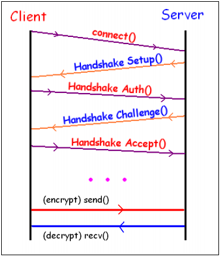
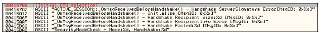

# A Guide to Silkroad's Security

### Introduction

This article will explain the current security system implemented in the MMORPG Silkroad Online. This guide will serve as a reference to the security protocol used by the game so you, the reader, can get a good understanding of what the game does to protect itself from outsiders. Once you understand how it all works, you will be able to implement it into your own programs.

As with any advance topics such as this, it will be assumed you have some knowledge of basic reverse engineering techniques, C/C++ experience, as well as an understanding of security concepts in general. I will provide plenty of pictures, side notes, and code to make this article as effective as possible, but it will be ultimately up to you to do the extra research when needed. With that said, it is time to get started!

### General Overview

To get started with a general overview on the Silkroad security protocol, here is a little picture to show what goes on in the security process.

<figure><figcaption></figcaption></figure>

The process starts when a Client wishes to connect to the server. Upon receiving the connection request, the Server sends a handshake setup packet to the client. This packet is parsed by the client and the security protocol is initialized. After the security system is initialized, the client sends a handshake authentication message to the server to establish its identity. Given this information, the server generates a handshake challenge message for the client to verify its identity. If the message matches what the client expects, then the client will send a handshake acceptance message to the server and the process is competed. If anything does not match up during the process, the connection will be closed.

After the handshake process has been completed, the client has a blowfish key that is used to encrypt and decrypt packets. Not all packets sent and received are encrypted or decrypted. This comes to a bit of a surprise in some cases, but makes a few things easier for us in the long run. Packets that are encrypted have an easy to identify marking, so when receiving or sending a packet, it will be obvious if it is encrypted or not.

The general format for Silkroad packets is as follows:

```c
// This is the generic packet structure
struct tPacket
{
    // Size of this packet
    WORD size;
    // Opcode of this packet
    WORD opcode;
    // Security count byte (0 from server to client packets)
    BYTE securityCount;
    // Security crc byte (0 from server to client packets)
    BYTE securityCRC;
    // Pointer to the remaining data and other packets
    BYTE dataPointer[8186];
};
```

**Size** – 2 bytes. The size of the data payload of the packet. Once again, this does not include the 6 bytes for the header.\
**Opcode** – 2 bytes. The opcode for the packet.\
**SecurityCount** – 1 byte. 0 if the packet is being sent from the server. This is only set for client to server packets.\
**SecurityCRC** – 1 byte. 0 if the packet is being sent from the server. This is only set for client to server packets.\
**DataPointer** – 0 or more bytes. This is the remaining data of the packet or possible more packets. I list it as being a max of 8186 bytes since that is the physical limit for the data being received along with the packet header, a total of 8192 bytes in a call to recv().

Now, for a few important notes on Silkroad packets that you should know:

* The packet header is 6 bytes total.
* On encrypted packets, the first two bytes, which refer to the size, are never encrypted.
* However, an encrypted packet is marked with a bit mask of 0x8000.
* The security count and CRC bytes are only set by the client and the server verifies them. If it fails, you will be disconnected.
* Packets are not received individually, they are grouped together. This means you will have to parse through the entire data stream received from the server.
* Packets are not guaranteed to be received in whole. This means you will have to maintain a buffer and check before you can parse a packet.

These notes will be expanded upon in the rest of the article, but deserve mention of now for a good base working knowledge.

Now that the general overview is completed, it is time to get to the specifics. What follows are three sections on each part of the protocol as well as applications of implementing the concepts and sample implementations. Rather than have to mess around with the Silkroad client, I will use the Silkroad launcher as the base means of study. This makes reversing a lot more simple since the code is very small and very fast to launch. For this article I will be using OllyDbg as the dissembler.

### The Handshake Process

The first question to be addressed is that of how do we know Silkroad even uses a handshake process? Part of the process of improving your skills as a reverse engineer is to look for the obvious. This does not fail us here. If we search through the referenced text strings for _Silkroad.exe_, we will come across the following:

<figure><figcaption></figcaption></figure>

Doing preliminary research by searching through the text strings immediately gives away some crucial information on what to expect. To be sure though, we should take a look at the packets sent back and forth between the client and server.

Here is an example listing of the first four messages (which happen to be the handshake process packets) captured using my own personal utility.

```
From Server to Client:
25 00 00 50 00 00 0E 70 82 27 11 5B 5F E5 28 E6
00 00 00 BF 00 00 00 8F 44 3E 0F DA 32 6B 2B 7F
FF C6 03 A3 25 1D 0C EF 6A BE 00

From Client to Server:
0C 00 00 50 CE 90 26 3B 0D 03 DA 69 80 F8 5E DE
39 8D

From Server to Client:
09 00 00 50 00 00 10 83 A3 B5 60 CE 67 D8 63

From Client to Server:
00 00 00 90 DB D5
```

If you were just starting out with reversing the packet format, it would not take too long to guess that the first two bytes is the size. In each of the data sets, the first two bytes describe how many additional bytes come after the first 6, so it would be presumed the packet header is 6 bytes. Remember that when reading hex strings such as this, you have to take the bytes backwards. The size of the first packet is 0x0025, the second is 0x000C, the third is 0x0009, and the forth is 0x0000.

From here on out, we will assume the presented packet format above is correct. This article is not about how to reverse the client to get this information as much as it is using it. Having said that, if we started up _Silkroad.exe_ a few times, we will see how the packets vary in the non header data. We can assume that this means we will have to dig into the client to figure out what is going on. However, this article is not about how to figure this out from scratch, this article is meant to explain the security protocol. This means I won’t be describing the steps of finding this information in the client.

Moving on, here is the first packet we received properly parsed. This is to show you what we will eventually arrive at through the following explanations.

```
[25 00] - Size
[00 50] - Opcode
[00] – Security Count
[00] – Security Crc
[0E] - Flag
[70 82 27 11 5B 5F E5 28] - Blowfish
[E6 00 00 00] – Count Seed
[BF 00 00 00] – CRC Seed
[8F 44 3E 0F] – Seed 1
[DA 32 6B 2B] – Seed 2
[7F FF C6 03] – Seed 3
[A3 25 1D 0C] – Seed 4
[EF 6A BE 00] – Seed 5
```

Starting out with the first packet we receive, we must first figure out which method of encryption to use for the connection. To do this, we look at the first byte in the dataPointer member of the packet structure. We can define a structure as follows to do this:

```c
// Base packet to figure out which one we have
struct Server_Packet_5000_Base
{
    // Internal flag
    BYTE flag;
};
```

The value of this flag tells the client what type of encryption we are working with. For the sake of this article, the value will be 0xE, which means blowfish, handshake, count, and security bytes. Everything the client has to offer will be enabled with this flag. Other modes selectively allow enabling one security system or another as well as disabling it all.

Here is a quick snippet to show the concept I am talking about to make sure no one gets lost. We simply use pointer casting on the data to easily get access to the data we want.

```c
// Handle the packets
switch(packet->opcode)
{
    case 0x5000:
    {
        Server_Packet_5000_Base * basePacket = (Server_Packet_5000_Base*)packet->dataPointer;
        switch(basePacket->flag)
        {
            // Full encryption packet
            case 0xE:
            {
            }
            break;
        }
    }
}
```

After we determine that the packet flag is 0xE, we can then perform a full type cast on the data into the full encryption packet. This packet will define the entire structure as seen above with the breakdown of the first packet received.

```c
// Full security packet
struct Server_Packet_5000_25
{
    // Internal flag (0xE)
    BYTE flag;
    // Initial blowfish key
    BYTE blowfish[8];
    // security count seed
    DWORD seedCount;
    // security crc seed
    DWORD seedCRC;
    // Additional seeds used
    DWORD seedSecurity1;
    DWORD seedSecurity2;
    DWORD seedSecurity3;
    DWORD seedSecurity4;
    DWORD seedSecurity5;
};
```

Here is the updated code snippet that shows the new pointer conversions. Debug messages are added to help verify that it works. Please note that these code snippets are just here for illustrations purposes and might not just compile without a few additions or changes.

```c
// Handle the packets
switch(packet->opcode)
{
    case 0x5000:
    {
        Server_Packet_5000_Base * basePacket = (Server_Packet_5000_Base*)packet->dataPointer;
        switch(basePacket->flag)
        {
            // Full encryption packet
            case 0xE:
            {
                Server_Packet_5000_25 * packet = (Server_Packet_5000_25*)packet->dataPointer;
                printf("1st Handshake Packet:\n");
                printf(" Flag: %X\n", packet->flag);
                printf(" Count Seed: %X\n", packet->seedCount);
                printf(" CRC Seed: %X\n", packet->seedCRC);
                printf(" Blowfish: %.2X %.2X %.2X %.2X %.2X %.2X%.2X %.2X\n", packet->blowfish[0], packet->blowfish[1], packet->blowfish[2], packet->blowfish[3], packet->blowfish[4], packet->blowfish[5], packet->blowfish[6], packet->blowfish[7]); 
                printf(" Handshake Seeds: %X %X %X %X %X\n", packet->seedSecurity1, packet->seedSecurity2, packet->seedSecurity3, packet->seedSecurity4, packet->seedSecurity5);
                printf("\n");
            }
            break;
        }
    }
}
```

Now that we know where each entry is, it is time to go over what each means and what it is used for. As mentioned above, the flag tells the client which type of security is to be used in this first packet. If this value is not 0xE, the packet will be a different length and contain different data.

The 8 byte array member named blowfish is the initial key used to seed the Blowfish algorithm with. This is done in case another security mode is used that gives the blowfish key to use directly. In our case with the 0xE flag, this Blowfish seeding is not of any use to us, since another key will be used.

The seed and CRC count members are the base values that tell the client how to setup the security bytes. More information on this process will be talked about in part two.

The last 5 DWORDs are additional seeds used by the client in the handshake process. They are very important and used a lot. We can track how they are used to follow the algorithm in code.

That covers the first packet we receive from the server in the start of the handshake process. What we have to go over now is what the client does with that data. If you were to trace through the client assembly code, it would not be hard to rip out that same code to use in your own program. However, that is a very messy thing to do and while it would work, it would make letting others use it hard. Because of this, I’ve converted the client’s assembly code into C++ much like jMerlin did in the code shown in part 2 of this article.

Due to the nature of the code logic, I cannot explain what the code does in English, but the general idea is that the client takes the passed seeds, performs numerical operations on it, then uses the results to generate the blowfish keys. There are two main helper functions that are needed in these calculations. Here they are:

```c
// Helper function used in the handshake
void Func_X_2(LPBYTE stream, DWORD key, BYTE keyByte)
{
    stream[0] ^= (stream[0] + LOBYTE(LOWORD(key)) + keyByte);
    stream[1] ^= (stream[1] + HIBYTE(LOWORD(key)) + keyByte);
    stream[2] ^= (stream[2] + LOBYTE(HIWORD(key)) + keyByte);
    stream[3] ^= (stream[3] + HIBYTE(HIWORD(key)) + keyByte);
    stream[4] ^= (stream[4] + LOBYTE(LOWORD(key)) + keyByte);
    stream[5] ^= (stream[5] + HIBYTE(LOWORD(key)) + keyByte);
    stream[6] ^= (stream[6] + LOBYTE(HIWORD(key)) + keyByte);
    stream[7] ^= (stream[7] + HIBYTE(HIWORD(key)) + keyByte);
}

// Helper function used in the handshake
DWORD Func_X_4(DWORD arg1, DWORD arg2, DWORD arg3)
{
    LARGE_INTEGER result = { 1, 0 };
    LARGE_INTEGER temp1 = { 0 };
    LARGE_INTEGER temp2 = { 0 };
    LARGE_INTEGER temp3 = { 0 };
    LARGE_INTEGER temp4 = { 0 };
    for (int x = 0; x < 32; ++x)
    {
        if (arg2 & 1)
        {
            temp1.LowPart = arg3;
            temp1.HighPart = 0;
            temp2.QuadPart = temp1.QuadPart * result.QuadPart;
            temp3.LowPart = arg1;
            temp3.HighPart = 0;
            temp4.QuadPart = temp2.QuadPart % temp3.QuadPart;
            result.QuadPart = temp4.QuadPart;
        }
        arg2 >>= 1;
        temp1.LowPart = arg3;
        temp1.HighPart = 0;
        temp1.QuadPart *= temp1.QuadPart;
        temp2.LowPart = arg1;
        temp2.HighPart = 0;
        temp3.QuadPart = temp1.QuadPart % temp2.QuadPart;
        arg3 = temp3.LowPart;
        if (!arg2)
            break;
    }
    return result.LowPart;
}
```

The first function will modify the bytes of the stream passed in by performing some sort of XOR obfuscation. This is a sensible operating since it can be reversed if the appropriate key and keyByte is known due to how XOR encryption works.

The second function is a bit beefier and took a lot longer to reverse. In essence, it is a function that will take some seeds and transform the result using 64bit math operations. The code works as is and is not optimized to use less variables, but you can mess with it if you wish.

Now that we have those two base functions shown, we can get into handling each of the security handshake packets. To start out, we will want to check to see if the packet we receive has a specific size and flag.

```c
// Pointer conversion
tPacket_5000 * basePacket = (tPacket_5000 *)stream;

// Check to see if this packet is the first packet of the handshake process
if(basePacket->size == 0x25 && basePacket->flag == 0xE)
```

If these conditions are true, we can continue to handle the packet. Here are some of the variable we will need to define for handling this packet.

```c
// This is the client generated random value. If you are NOT doing a clientless, you will have to
// figure out how to take this value from the client itself, or modify the client to use your value
// Finding the location is easy, just search for:
//
// Push EAX
// Call CoCreateGui
// MOV ECX, DWORD PTR SS:[ESP+4]
// AND ECX, 7FFFFFFF
//
// There might be a few, so break point on them all to see which one triggers.
GUID guid = { 0 };

// This holds the private blowfish key
DWORD keyArray[2] = { 0 };

// This holds the private blowfish data
DWORD keyArray2[2] = { 0 };

// Key byte variable used for a few operations
BYTE keyByte = 0;

// The current packet
tPacket_5000_E * packet = 0;

// Args used for the functions
DWORD dwArgs[18];
```

We will first setup the random value for the handshake and initialize the Blowfish algorithm. Note that the Blowfish is not used until later in this process, so this step of seeding the blowfish with the initial value is not essential. The client creates this value, so if you are going to intercept the client packets, you will need to know this value from the client!

```c
CoCreateGuid(&guid);
dwRand = guid.Data1 & 0x7FFFFFFF;

// Initialize the initial blowfish (not used for the E flag at first)
blowfish.Initialize((LPBYTE)packet->blowfish, 8);
```

Now we get to the real magic of the security system. Here are the things that go on in setting up the handshake based on the first packet.

```c
// Store the seeds into the arguments
dwArgs[10] = packet->seedSecurity[3];
dwArgs[11] = packet->seedSecurity[2];
dwArgs[12] = packet->seedSecurity[4];
dwArgs[15] = packet->seedSecurity[0]; 
dwArgs[16] = packet->seedSecurity[1];

// Setup more arguments as best ordered in the client
dwArgs[0] = dwArgs[11];
dwArgs[1] = dwArgs[10];
dwArgs[3] = dwRand;
dwArgs[5] = Func_X_4(dwArgs[1], dwArgs[3], dwArgs[0]);
dwArgs[13] = dwArgs[5];
dwArgs[4] = dwArgs[12];
dwArgs[6] = Func_X_4(dwArgs[1], dwArgs[3], dwArgs[4]);
dwArgs[14] = dwArgs[6];

//-------------------------------------------

// Generate the private blowfish key
keyByte = LOBYTE(LOWORD(dwArgs[14])) & 0x03;
keyArray[0] = dwArgs[12];
keyArray[1] = dwArgs[13];
Func_X_2((LPBYTE)keyArray, dwArgs[14], keyByte);

// Initialize the blowfish
blowfish.Initialize((LPBYTE)keyArray, 8);
```

Once the Blowfish is initialized with the private key, we have to encode the data and then send it to the server.

```c
// Generate the private blowfish data
keyArray2[0] = dwArgs[5];
keyArray2[1] = dwArgs[4];
keyByte = LOBYTE(LOWORD(dwArgs[5])) & 0x07;
Func_X_2((LPBYTE)keyArray2, dwArgs[14], keyByte);

// Blowfish Encode on data to send it (note the packet itself is not encrypted!)
blowfish.Encode((LPBYTE)keyArray2, (LPBYTE)keyArray2, 8);
```

To create the first response packet, here is one method that is messy, but accomplishes the task.

```c
// build the packet
BYTE packetBuffer[32] = {0};
*(LPWORD)(packetBuffer + 0) = 0xC;
*(LPWORD)(packetBuffer + 2) = 0x5000;
*(LPDWORD)(packetBuffer + 6) = dwArgs[13];
*(LPDWORD)(packetBuffer + 10) = *(keyArray2 + 0);
*(LPDWORD)(packetBuffer + 14) = *(keyArray2 + 1);

// Set the count byte
packetBuffer[4] = GenerateCountByte();

// Set the crc byte
packetBuffer[5] = GenerateCheckByte((char*)packetBuffer, 18,firstPacket.seedCRC);

//------------------------------------------- 

// Send the packet
send(s, (char *)packetBuffer, 18, 0);
```

At this point the client sends the response and waits for a reply from the server that contains the second half of the handshake. Please note the use of the security bytes have not been talked about yet, but will be covered in the second part of this article.

After knowing what the client does with the first packet and how it responds to it, we have to take a look at the second packet from the server. Just as a reminder, here is the packet group we are on now:

```
From Server to Client:
09 00 00 50 00 00 10 83 A3 B5 60 CE 67 D8 63

From Client to Server:
00 00 00 90 DB D5
```

Here is a break down of the second packet we receive as part of the handshake process:

```
[09 00] – Size
[00 50] - Opcode
[00] – Count Byte
[00] – CRC Byte
[10] - Flag
[83 A3 B5 60 CE 67 D8 63] - Blowfish
```

Like the first packet the client received from the server, we will need to do a pointer cast on the data to a `Server_Packet_5000_Base` object. Once we do that, we will see the flag is 0x10. The 0x10 flag means that the server is sending a new blowfish key to base the handshake protocol on. That might not be worded entirely correctly, but the idea is the client takes that data and transforms it into a new blowfish key by encoding it with the previous blowfish key.

Here is the structure for this specific packet. Remember that this is for typecasting on the packet->dataPointer member, not the packet itself since there is a 6 byte header.

```c
// Blowfish handshake accept challenge packet
struct Server_Packet_5000_9
{
    // Internal flag (0x10)
    BYTE flag;

    // Next blowfish key base
    BYTE blowfish[8];
};
```

After the client handles this packet and generates a new blowfish key, the handshake process is completed. From here, the client will send a “connection accepted” message back to the server to let it know everything is fine. This is shown in the bottom packet from the client to the server.

This response packet is marked with an opcode of 0x9000 and has no size, 0x0000. The trailing two bytes are the security bytes, which will be talked about in the next part. Now for the code that does all of this. Once again, the first thing we want to do is make sure the packet we are processing is the right type of packet.

```c
// Check to see if this packet is the second packet of the handshake process
else if(basePacket->size == 9 && basePacket->flag == 0x10)
```

We have fewer variables at this stage of the handshake because it is the verification stage. All of the major calculations have been done already.

```c
// Packet pointer
tPacket_5000_10 * packet = 0;

// This holds the private blowfish data
DWORD keyArray[2] = {0};

// Key byte variable used for a few operations
BYTE keyByte = 0;
```

At this point, we will take the message the server sent us and encode it using our private key.

```c
// Generate the new private bf key data
keyArray[0] = dwArgs[4];
keyArray[1] = dwArgs[5];

// Generate the key byte
keyByte = LOBYTE(LOWORD(dwArgs[4])) & 0x07;

// Modify the data
Func_X_2((LPBYTE)keyArray, dwArgs[14], keyByte);

// Encode the data
blowfish.Encode((LPBYTE)keyArray, (LPBYTE)keyArray, 8);
```

Now, the client has to verify the data matches the expected data. Hint: search for a similar string in the client to find the exact location where this happens.

```c
// Simple check to see if the handshake is good
if (keyArray[0] != packet->challenge[0] || keyArray[1] != packet->challenge[1])
{
    MessageBox(0, "ACTIVE_SESSION::_OnMsgReceivedBeforeHandshake() - Handshake ServerSignature Error.", "Fatal Error", MB_ICONERROR);
    exit(-1);
}
```

In the above code, I use a simple method to check the values. If the values do not match, then you will definitely not want to continue! Once we are sure the handshake is valid, we can get the real Blowfish key and seed our side of the connection with it.

```c
// Calculate the final blowfish key 
keyArray[0] = dwArgs[15];
keyArray[1] = dwArgs[16];
Func_X_2((LPBYTE)keyArray, dwArgs[6], 0x3);

// Initialize the blowfish
blowfish.Initialize((LPBYTE)keyArray, 8);
```

The last thing to do now is to send the connection accepted packet to the server. As with the previous example, this is messy code, but should work.

```c
// build the packet
BYTE packetBuffer[32] = { 0 };
*(LPWORD)(packetBuffer + 0) = 0x0;
*(LPWORD)(packetBuffer + 2) = 0x9000;

// Set the count byte
packetBuffer[4] = GenerateCountByte();

// Set the crc byte
packetBuffer[5] = GenerateCheckByte((char*)packetBuffer, 6, firstPacket.seedCRC);

// Send the packet
send(s, (char *)packetBuffer, 6, 0);
```

After these 4 packets are sent back and forth between the client and server (2 from each side), the security system is setup between the client and server, so the client can begin the regular packet processing. This marks the end of the Handshake Process, so it is time to get into the security byte generation first and then the blowfish encryption.


Page added for context reference.\
TODO: Transcript all the remaining guide.

