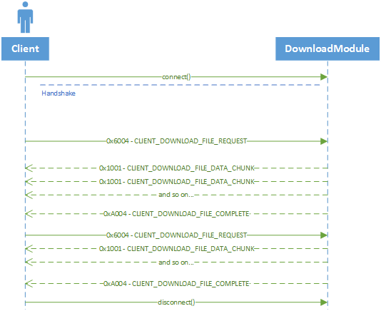

# Download Packets

Packets used when communicating with DownloadServer.

<table><thead><tr><th width="100">Opcode</th><th width="215">Direction ( Client / Server )</th><th>Name</th></tr></thead><tbody><tr><td>0x6004</td><td>C > S</td><td><a href="download_file_req.md">DOWNLOAD_FILE_REQ</a></td></tr><tr><td>0x1001</td><td>S > C</td><td><a href="download_file_chunk.md">DOWNLOAD_FILE_CHUNK</a></td></tr><tr><td>0xA004</td><td>S > C</td><td><a href="download_file_complete.md">DOWNLOAD_FILE_COMPLETE</a></td></tr></tbody></table>

### Diagram

<figure><figcaption></figcaption></figure>
