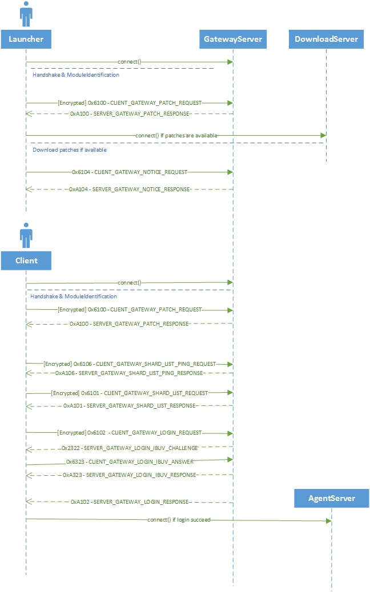

# Gateway Packets

Packets used when communicating with GatewayServer.

<table><thead><tr><th width="100">Opcode</th><th width="215">Direction ( Client / Server )</th><th>Name</th></tr></thead><tbody><tr><td>0x6100</td><td>C > S</td><td><a href="gateway_patch_req.md">GATEWAY_PATCH_REQ</a></td></tr><tr><td>0xA100</td><td>S > C</td><td><a href="gateway_patch_ack.md">GATEWAY_PATCH_ACK</a></td></tr><tr><td>0x6104</td><td>C > S</td><td><a href="gateway_notice_req.md">GATEWAY_NOTICE_REQ</a></td></tr><tr><td>0xA104</td><td>S > C</td><td><a href="gateway_notice_ack.md">GATEWAY_NOTICE_ACK</a></td></tr><tr><td>0x6101</td><td>C > S</td><td><a href="gateway_shard_list_req.md">GATEWAY_SHARD_LIST_REQ</a></td></tr><tr><td>0xA101</td><td>S > C</td><td><a href="gateway_shard_list_ack.md">GATEWAY_SHARD_LIST_ACK</a></td></tr><tr><td>0x6106</td><td>C > S</td><td>GATEWAY_SHARD_LIST_PING_REQ</td></tr><tr><td>0xA106</td><td>S > C</td><td>GATEWAY_SHARD_LIST_PING_ACK</td></tr><tr><td>0x6102</td><td>C > S</td><td><a href="gateway_login_req.md">GATEWAY_LOGIN_REQ</a></td></tr><tr><td>0xA102</td><td>S > C</td><td><a href="gateway_login_ack.md">GATEWAY_LOGIN_ACK</a></td></tr><tr><td>0x2322</td><td>S > C</td><td>GATEWAY_LOGIN_IBUV_CHALLENGE</td></tr><tr><td>0x6323</td><td>C > S</td><td>GATEWAY_LOGIN_IBUV_CONFIRM_REQ</td></tr><tr><td>0xA323</td><td>S > C</td><td>GATEWAY_LOGIN_IBUV_CONFIRM_ACK</td></tr></tbody></table>


IBUV stands for "Image Based User Verification" (Captcha)


### Diagram

<figure><figcaption></figcaption></figure>
