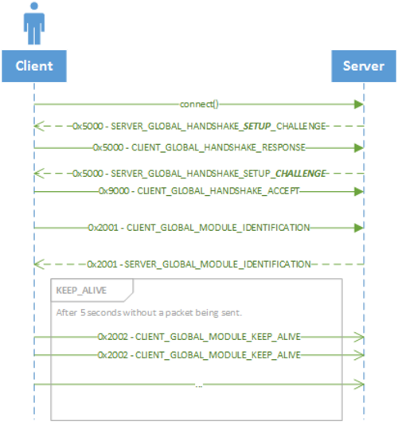

# Global Packets

Packets used when communicating with any server (globally used).

<table data-full-width="true"><thead><tr><th width="178">Opcode</th><th width="231">Direction ( Client &#x3C;--> Server )</th><th>Name</th></tr></thead><tbody><tr><td>0x5000</td><td>-</td><td>HANDSHAKE_CHALLENGE</td></tr><tr><td>0x9000</td><td>C > S</td><td>HANDSHAKE_ACCEPT</td></tr><tr><td>0x2001</td><td>-</td><td>MODULE_IDENTIFICATION</td></tr><tr><td>0x2002</td><td>C > S</td><td>MODULE_KEEP_ALIVE</td></tr><tr><td>0x6003</td><td>C > S</td><td>MODULE_CERTIFICATION_REQ</td></tr><tr><td>0xA003</td><td>S > C</td><td>MODULE_CERTIFICATION_ACK</td></tr><tr><td>0x2005</td><td>S > C</td><td>MODULE_UPDATE_STATE</td></tr><tr><td>0x6005</td><td>S > C</td><td>MODULE_UPDATE_STATE_REQ</td></tr><tr><td>0x6008</td><td>C > S</td><td>MODULE_RELAY_REQ</td></tr><tr><td>0xA008</td><td>S > C</td><td>MODULE_RELAY_ACK</td></tr><tr><td>0x600D</td><td>-</td><td>MASSIVE_MESSAGE</td></tr><tr><td>0x2209</td><td>-</td><td>RELAY_CLIENT_MESSAGE</td></tr></tbody></table>

### Diagram

<figure><figcaption></figcaption></figure>
